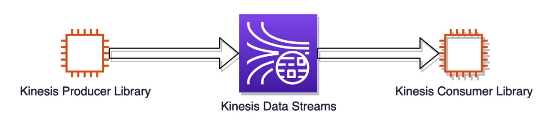

# Kinesis Data Streams Lab

# Introdução
O objetivo desse lab é realizar um exemplo prático simples da utilização do Kinesis Data Streams com os componentes KPL (Kinesis Producer Library) e KCL (Kinesis Consumer Library).

# Passos laboratório

## Criando Kinesis Data Stream
Procure pelo serviço Kinesis e realize a crição do Kinesis Data Streams com a seguinte configuração:
- Data Stream Name: kinesis-kpl-demo
- Number of open shards: 2

Dessa forma teremos 2MiB/sec, 2000 registros/sec de escrita e 4MiB/sec de leitura. É possível habilitar criptografia, métricas aprimoradas e alterar o tempo de retenção. Também é possível habilitar enhanced fan-out.

Agora que o Kinesis Data Stream está criado, precisamos criar os produtores e consumidores. 

## KPL - Kinesis Producer Library
Procure pelo serviço EC2 e crie uma instância do tipo t2.micro, com a imagem Amazon Linux 2 AMI (HVM) - Kernel 5.10, SSD Volume Type. 
### Configurações
### Instale java e o maven
1. Conecte-se a instância EC2 criada via SSH
2. Adicione o repositório do pacote do Maven e inicia as instalões
- sudo wget https://repos.fedorapeople.org/repos/dchen/apache-maven/epel-apache-maven.repo -O /etc/yum.repos.d/epel-apache-maven.repo
- sudo sed -i s/\$releasever/6/g /etc/yum.repos.d/epel-apache-maven.repo
- sudo yum install -y apache-maven
- sudo yum install -y java-1.8.0-devel
3. Selecione o Java 8 como o padrão de execução:
- sudo /usr/sbin/alternatives --config java
- - Insira o número correspondente ao Java 8
- sudo /usr/sbin/alternatives --config javac
- - Insira o número correspondente ao Java 8
4. Verifique se as instalões foram realizadas com sucesso
- mvn -version
- java -version

### Obtendo o projeto
5. Clone o projeto de exemplo da AWS
- sudo yum install git
- git clone https://github.com/awslabs/amazon-kinesis-producer
- Na classe [SampleProducer](https://github.com/awslabs/amazon-kinesis-producer/blob/master/java/amazon-kinesis-producer-sample/src/com/amazonaws/services/kinesis/producer/sample/SampleProducer.java) é realizado a configuração do producer (81), a criação (88)e o start (124).
- Na classe [SampleProducerConfig](https://github.com/awslabs/amazon-kinesis-producer/blob/master/java/amazon-kinesis-producer-sample/src/com/amazonaws/services/kinesis/producer/sample/SampleProducerConfig.java) podemos observar os parâmetros referente a região - setRegion, o timeout - getRequestTimeout, tempo para criar buffer para envio - setRecordMaxBufferedTime e habilitar a agregação - setAggregation(Enabled, MaxCount, MaxSize).

## Iniciando o producer
- cd /home/ec2-user/amazon-kinesis-producer/java/amazon-kinesis-producer-sample

# Apoio Teórico
## O que é o Kinesis Data Stream
Kinesis Data Stream é utilizado para realizar envio de informações em streaming . É um componente semelhante ao Kafka. As informações são armazenadas em Shards (semelhantes a partições do Kafka). Há produtores que enviam informações para os shards e consumidores que leem essas informações.

## Tipos de produtores
Há 3 tipos principais de produtores: Kinesis Producer Library, KinesisAPI e KinesisAgent. 

## Agregação de registros
KPL pode enviar um grupo de múltiplos registros em cada solicitação evitando custos e sobrecargas descenessárias ao realizar múltiplas requisições para cada registro individualmente. Em caso de falha de um desses registros, apenas este registro é considerado como falha, garantindo o envio dos demais. Também são realizadas novas tentativas desse registro com falha. 

Para realizar o envio de forma agregada, temos as seguintes configurações:
- AggregationEnabled="true"
- RecordMaxBufferedTime = 2000 miliseconds

Dessa forma podemos configrar quantos milisegundos iremos esperar antes de enviar os registros, podendo variar para mais ou para menos dependendo da necessidade do cenário.

Para o caso de KinesisApi, serão enviados os registros instantaneamente para casos em que seja necessário o processamento imediado. Também é possível configurar o envio de múltiplos registros pela API. 

## Como calcular a capacidade?
A capacidade é determinada pelo número de shards. Cada shards é capaz de receber 1MiB/seg e 1000 registros/seg e envia até 2MiB/seg. Se a escrita ou leitura exceder essa capacidade, a aplicação receberá exceções.

## Enhanced Fan-Out Consumers
Enhanced Fan-out é uma feature do Kinesis Data Streams que habilita o consumo de dados em stream com throughput dedicado de 2 MB /sec/shard. Isso permite que o consumidor com essa feature não se preocupe com o consumo de outros consumidores, além de aumentar a sua capacidade de receber registros.